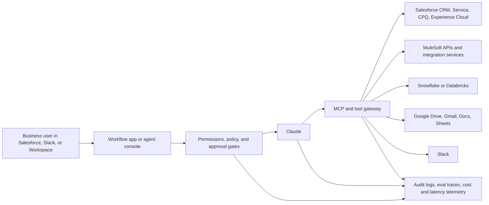

## Executive Thesis

Salesforce-heavy enterprises need deployment patterns for high-volume workflows that span CRM, service, billing, documents, partner channels, data warehouses, collaboration tools, and integration middleware.

Claude can become useful in these environments when it is treated as a governed enterprise capability: connected to the right systems, constrained by permissions, evaluated against real tasks, instrumented for audit, and packaged into workflows that business teams already recognize.

This playbook defines the workflows, reference architecture, evaluation model, agent patterns, rollout plan, and partner operating model needed to deploy Claude repeatably in Salesforce-centered enterprises.

  

    <strong>Enterprise integration</strong>
    Salesforce, MuleSoft, data platforms, Slack, Google Workspace, and system-of-record permissions.
  

  

    <strong>Technical architecture</strong>
    Retrieval, tool use, MCP servers, audit logging, escalation, and controlled write paths.
  

  

    <strong>Adoption mechanics</strong>
    Evaluations, pilot success criteria, operating cadence, SI enablement, and production governance.
  

## 1. Target Workflows

The highest-value Claude deployments start where enterprise workflows are document-heavy, decision-heavy, cross-system, and painful to coordinate manually. In Salesforce-heavy companies, those workflows usually share the same pattern: Salesforce holds the customer or case context, another system holds financial or operational truth, documents contain unstructured evidence, and employees coordinate through Slack, email, spreadsheets, or service queues.

The system of record still owns the record. Claude is useful at the point where people currently read, reconcile, summarize, route, compare, draft, and escalate; that is where the workflow can get faster, more accurate, and easier to govern.

  <article>
    <h3>Sales Ops</h3>
    
Account research, opportunity hygiene, quote readiness, renewal summaries, territory exceptions, meeting prep, CRM note normalization, and deal-risk detection.

    
<strong>Proof metric:</strong> fewer stale fields, cleaner handoffs, faster executive deal reviews.

  </article>
  <article>
    <h3>Service Ops</h3>
    
Case triage, entitlement checks, SLA summaries, troubleshooting context, customer response drafts, knowledge article recommendations, and escalation packets.

    
<strong>Proof metric:</strong> reduced time to first meaningful action and stronger escalation quality.

  </article>
  <article>
    <h3>Onboarding</h3>
    
New customer intake, implementation requirement extraction, account plan creation, kickoff brief generation, missing-data detection, and implementation task routing.

    
<strong>Proof metric:</strong> fewer kickoff misses and shorter implementation discovery cycles.

  </article>
  <article>
    <h3>Invoice Ops</h3>
    
Invoice exception review, purchase order matching, billing dispute summaries, payment history explanations, dunning support, and finance-to-sales coordination.

    
<strong>Proof metric:</strong> faster exception resolution with documented rationale.

  </article>
  <article>
    <h3>Partner Intake</h3>
    
Partner application review, eligibility checks, channel conflict analysis, onboarding packet generation, territory mapping, and compliance documentation.

    
<strong>Proof metric:</strong> consistent partner decisions and clearer approval trails.

  </article>
  <article>
    <h3>Loan and Document Intake</h3>
    
Document classification, missing-document detection, borrower or applicant summaries, policy checks, fraud indicators, and reviewer workbench preparation.

    
<strong>Proof metric:</strong> faster reviewer throughput without weakening controls.

  </article>
  <article>
    <h3>Delivery PM</h3>
    
Status synthesis across tasks, risks, decisions, blockers, scope changes, resource notes, customer communications, and project governance artifacts.

    
<strong>Proof metric:</strong> less manual status assembly and better risk visibility.

  </article>
  <article>
    <h3>Integration Discovery</h3>
    
API inventory, object and field mapping, event trigger analysis, endpoint documentation, migration scoping, and current-state architecture summaries.

    
<strong>Proof metric:</strong> shorter discovery timelines and fewer missed dependencies.

  </article>

## 2. Reference Architecture

Claude should sit inside an enterprise architecture that treats AI output as a governed workflow participant rather than an uncontrolled side channel. The reference architecture below assumes Salesforce is the primary operating system for customer, case, opportunity, partner, or intake state. MuleSoft or a comparable integration layer brokers access to downstream systems. Snowflake or Databricks provides analytical and historical context. Slack and Google Workspace provide collaboration and document surfaces. Permissions and audit logging are enforced across every path.

### Core Components

| Component | Role in the deployment | Control requirement |
|---|---|---|
| Claude | Reads context, plans task steps, drafts outputs, calls approved tools, and explains decisions. | Prompt and skill versioning, model selection, trace capture, cost limits, latency targets. |
| Salesforce | Holds customer, case, opportunity, lead, partner, project, and workflow state. | Object-level, field-level, row-level, and sharing enforcement. |
| MuleSoft | Normalizes system access and mediates write paths to ERP, billing, fulfillment, and external services. | API policies, rate limits, schema contracts, retries, and error handling. |
| Snowflake or Databricks | Supplies historical patterns, analytics, operational metrics, and aggregated context. | Query governance, PII masking, role-based warehouses or clusters, lineage. |
| Slack and Google Workspace | Capture collaboration context, documents, approvals, and communication outputs. | Workspace permissions, channel scope, document ACLs, retention, legal hold. |
| MCP servers and tool gateway | Expose bounded tools for retrieval, search, record lookup, write requests, and workflow actions. | Tool allowlists, input validation, scoped credentials, audit traces, approval gates. |
| Audit and eval layer | Measures behavior across tasks, tool calls, permissions, factuality, and regressions. | Durable logs, replayable eval sets, exception reports, human-review queue. |

### Design Principles

First, retrieval should be permission-aware. If a user cannot see an Account, Case, document, Slack channel, warehouse table, or field in the underlying system, Claude should not use that context.

Second, writes should be deliberate. Low-risk writes can be executed through bounded tools with clear validation. Medium-risk writes should require human confirmation. High-risk writes should generate prepared changes or tickets, not execute directly.

Third, every production workflow needs an audit trail. The trace should show which user initiated the task, which data was retrieved, which tools were called, which records were changed, which approvals were captured, what Claude produced, and whether the outcome passed evaluation criteria.

Fourth, architecture should preserve existing enterprise investments. The deployment should strengthen Salesforce governance, integration contracts, data platform controls, and collaboration workflows rather than bypass them.

## 3. Evaluation Framework

Enterprise deployments fail when evaluation is treated as a demo checklist. A Salesforce-heavy Claude deployment needs evaluation sets that mirror real work: messy records, missing fields, inconsistent documents, partial permissions, stale integration states, and ambiguous escalation rules.

The evaluation framework should be owned jointly by AI platform, business operations, Salesforce architecture, security, and the SI or implementation partner. Each workflow should launch with a regression set that can be replayed whenever prompts, skills, tools, models, permissions, integrations, or data mappings change.

| Evaluation Dimension | What to Measure | Example Test |
|---|---|---|
| Task success | Did the workflow outcome meet the business objective? | Create an onboarding brief that identifies required stakeholders, missing data, risks, and next actions from CRM plus documents. |
| Factuality | Are claims grounded in retrieved source data? | Verify every invoice dispute explanation against invoice, payment, account, and email evidence. |
| Tool-call correctness | Did Claude select the right tool, pass valid inputs, and handle errors? | Confirm it uses Salesforce lookup before drafting an account summary and does not invent unavailable fields. |
| Permission adherence | Did the agent respect user, object, field, row, document, and channel permissions? | Run the same task as a sales rep, service manager, finance user, and external partner. |
| Regression behavior | Do known edge cases stay fixed as prompts, tools, or models change? | Replay examples with duplicate Accounts, merged Cases, expired entitlements, and missing purchase orders. |
| Human escalation | Did Claude escalate at the right time with enough context? | Route low-confidence loan packet decisions to a reviewer with evidence and recommended next steps. |
| Cost and latency | Is the workflow economically and operationally viable? | Measure median and p95 time, token use, tool count, retries, and escalation cost by workflow. |

### Minimum Evaluation Artifacts

Each production candidate should have a compact but serious evaluation pack:

- A workflow charter with business objective, allowed actions, prohibited actions, source systems, and approval rules.
- A golden task set with successful examples, edge cases, known failure cases, and red-team prompts.
- A factuality rubric that defines acceptable evidence, citations, uncertainty language, and unsupported-claim handling.
- A permission matrix covering Salesforce profiles, permission sets, sharing behavior, Slack channels, documents, and data-platform roles.
- A tool-call rubric that scores tool selection, argument validity, error handling, retries, idempotency, and write safety.
- A production telemetry dashboard for adoption, success, exception rate, escalation rate, cost, latency, and user feedback.

## 4. Agent Patterns

The most durable Claude deployments are built from repeatable patterns instead of one-off prompts. The patterns below are the baseline for Salesforce-heavy enterprise workflows.

  <section>
    <h3>Retrieval Pattern</h3>
    
Retrieve source context before reasoning. Use Salesforce records, related lists, Knowledge, files, Slack threads, Workspace documents, and warehouse facts through permission-aware search. Return grounded summaries with citations or source references where the user needs auditability.

  </section>
  <section>
    <h3>Tool-Use Pattern</h3>
    
Expose narrow tools for actions such as record lookup, field validation, entitlement check, quote status check, invoice lookup, document classification, or ticket creation. Each tool should define schema, auth scope, retry behavior, logging, and error messages.

  </section>
  <section>
    <h3>MCP Server Pattern</h3>
    
Use MCP servers as controlled bridges into enterprise systems. Keep servers small enough to reason about, version tool contracts, separate read and write capabilities, and use service accounts only where business ownership and audit requirements are clear.

  </section>
  <section>
    <h3>Subagent Pattern</h3>
    
Split complex work into scoped subagents: document reader, Salesforce analyst, integration mapper, policy checker, response drafter, and QA reviewer. The orchestration layer should merge results, detect disagreement, and escalate unresolved conflicts.

  </section>
  <section>
    <h3>Workflow-Specific Skills</h3>
    
Package reusable instructions, examples, schemas, rubrics, and system rules as skills for each workflow. Sales ops, service ops, invoice ops, loan intake, and integration discovery should not share one generic enterprise prompt.

  </section>
  <section>
    <h3>Approval Gate Pattern</h3>
    
Require explicit approval before write actions that affect customers, money, contracts, compliance, external communications, or partner status. Present the proposed change, source evidence, risk level, and rollback path before execution.

  </section>

### Write-Safety Tiers

| Tier | Agent behavior | Example |
|---|---|---|
| Tier 0: Read only | Summarize, classify, compare, search, and prepare recommendations. | Draft a case escalation packet without changing the Case. |
| Tier 1: Prepared write | Generate a proposed change for human review. | Prepare Account field updates with source evidence. |
| Tier 2: Approved write | Execute after explicit user approval and validation. | Update onboarding task ownership after the PM approves the plan. |
| Tier 3: Controlled automation | Execute routine low-risk writes under policy and audit. | Add standardized internal notes or create follow-up tasks. |
| Tier 4: Restricted | Never execute directly; escalate to owner or governed system. | Change payment terms, approve credit, alter contract language, or override compliance status. |

## 5. Deployment Plan

The deployment plan should move from proof to production in 90 days without pretending that every enterprise workflow is ready for autonomous action on day one. The practical path is to start with read-heavy workflows, add evaluated tool use, introduce controlled writes, and then scale through repeatable partner delivery.

  <section>
    <h3>Days 0-30: Pilot and Baseline</h3>
    
<strong>Objective:</strong> prove value in one or two workflows with real enterprise context and read-only or prepared-write behavior.

    <ul>
      <li>Select two workflows with measurable pain, available data, and business owners.</li>
      <li>Map source systems, permissions, approval rules, escalation paths, and audit requirements.</li>
      <li>Build the first MCP/tool gateway for permission-aware Salesforce and document retrieval.</li>
      <li>Create a golden evaluation set using real examples, sanitized where needed.</li>
      <li>Run user-supervised pilots inside the existing operating rhythm.</li>
    </ul>
    
<strong>Exit criteria:</strong> measurable time savings, acceptable factuality, no permission failures, clear failure modes, and business approval to expand.

  </section>
  <section>
    <h3>Days 31-60: Controlled Production Path</h3>
    
<strong>Objective:</strong> harden the workflows, add integrations, and introduce approved-write actions where risk is manageable.

    <ul>
      <li>Expand retrieval to related Salesforce objects, Slack, Workspace, and warehouse context.</li>
      <li>Instrument traces, cost, latency, tool calls, escalation, and user feedback.</li>
      <li>Add approval gates and write-safety tiers for specific actions.</li>
      <li>Run regression tests before every prompt, skill, tool, or model change.</li>
      <li>Define support ownership across business operations, AI platform, Salesforce, and SI teams.</li>
    </ul>
    
<strong>Exit criteria:</strong> production support model, replayable evals, approved security review, and a workflow owner willing to sponsor broader adoption.

  </section>
  <section>
    <h3>Days 61-90: Scale and Partner Enablement</h3>
    
<strong>Objective:</strong> turn the deployment into a repeatable delivery motion across workflows, business units, and accounts.

    <ul>
      <li>Package workflow skills, tool schemas, evaluation packs, implementation guides, and architecture templates.</li>
      <li>Launch a second wave of workflows using the same governance pattern.</li>
      <li>Create a model for SI-led discovery, build, eval, release, and post-production optimization.</li>
      <li>Publish executive reporting on adoption, quality, ROI, risk, and operating maturity.</li>
      <li>Train internal champions and partner delivery teams on deployment patterns instead of demo scripts.</li>
    </ul>
    
<strong>Exit criteria:</strong> repeatable deployment kit, partner delivery model, executive adoption metrics, and a roadmap for workflow expansion.

  </section>

## 6. Partner and SI Operating Model

Anthropic can multiply enterprise adoption by enabling SIs to deliver Claude deployments as a governed implementation practice. The SI motion should center on repeatable workflow change in environments where Salesforce is one of several enterprise systems.

### What Anthropic Should Give SIs

| Enablement Asset | Purpose |
|---|---|
| Reference architectures | Standard patterns for Salesforce, MuleSoft, data platforms, Slack, Workspace, permissions, audit, and MCP tool gateways. |
| Workflow blueprints | Packaged use-case maps for sales ops, service ops, onboarding, invoice ops, partner intake, loan intake, delivery PM, and integration discovery. |
| Evaluation templates | Rubrics, golden-set formats, regression harnesses, factuality scoring, tool-call scoring, and permission test cases. |
| Skill and prompt patterns | Reusable workflow-specific instructions with examples, anti-patterns, tool contracts, and approval-gate language. |
| Deployment checklists | Security review, data access, logging, escalation, support, monitoring, cost controls, and release readiness. |
| Partner certification labs | Hands-on labs where SIs build, evaluate, break, repair, and deploy realistic enterprise workflows. |

### How SIs Should Deliver

The SI delivery motion should be operational rather than sales-led.

1. Discovery maps the real workflow, source systems, decision rules, pain points, permissions, and measurable outcomes.
2. Architecture defines the Claude interaction surface, tool gateway, retrieval paths, write-safety tiers, audit model, and support ownership.
3. Build creates the workflow skill, MCP tools, integration adapters, UI surface, and telemetry.
4. Evaluation tests task success, factuality, permissions, tool correctness, escalation, cost, latency, and regressions.
5. Pilot runs with business users on real work, captures feedback, and compares performance against the baseline.
6. Production launch adds support, monitoring, change control, release cadence, and executive reporting.
7. Expansion repeats the model across adjacent workflows with reusable artifacts instead of bespoke demos.

### Avoiding Demo-First Delivery

Demo-first behavior happens when teams optimize for an impressive demo instead of operational adoption. This operating model avoids that pattern by requiring every workflow to have:

- A business owner with a measurable operating problem.
- A defined system boundary and source-of-truth map.
- Permission-aware retrieval and governed write paths.
- A replayable evaluation set before production.
- Human escalation rules and support ownership.
- Telemetry for cost, latency, success, errors, and adoption.
- A repeatable package that the next project can reuse.

## Proof Package

This playbook can serve as the landing artifact for a targeted application, partner conversation, or consulting motion because it shows the work at the level enterprise buyers and platform teams care about: architecture, evals, integrations, permissions, rollout mechanics, and repeatable delivery.

The next proof layer would be a companion demo workflow: for example, a Salesforce Case escalation assistant or invoice exception reviewer that uses a bounded MCP tool gateway, a small evaluation set, and a write-safety approval gate. That would make the playbook tangible without turning the page into a generic product pitch.
