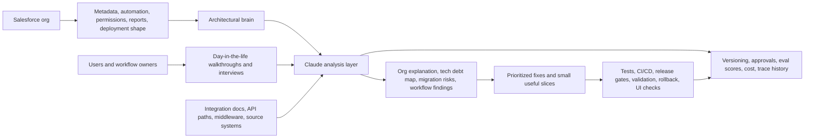

## Executive Thesis

I do not start Salesforce AI work with a chat interface. I start by understanding the org.

The first move is an in-depth org scan using an architectural brain: metadata, automation, permissions, integrations, deployment shape, old decisions, and the land mines hiding from years of change. That scan gets paired with contextual interviews and day-in-the-life walkthroughs from actual users. The system says one thing. People doing the work usually reveal another.

Claude is useful here as a thinking layer. It can process scan output, walkthrough notes, recorded interviews, implementation docs, and migration artifacts to pull out patterns that are hard to see from the first layer of evidence. I use it to make the system explain itself, expose the workarounds, and shorten the path from diagnosis to a provably safer fix.

The work here is the part I know best: integration discovery, data migration readiness, tech debt cleanup, and getting the pipeline to production moving fast enough that fixes can actually land.

  

    <strong>Architectural brain first</strong>
    Metadata, automation, permissions, integrations, deployment pipeline, stale configuration, and current-state risk.
  

  

    <strong>User reality second</strong>
    Day-in-the-life walkthroughs, interviews, workarounds, pain points, and the parts of the process that never show up in architecture docs.
  

  

    <strong>Small useful slices</strong>
    Fix the acute problem, aim at the chronic one, and prove each step before expanding the scope.
  

## 1. Target Workflows

The first useful workflow is usually an org explainer and tech debt resolver.

Salesforce-heavy businesses usually have the same underlying issue: the business keeps changing, but the system carries every old decision forward. Integrations pile up. Fields lose their meaning. Permissions drift. Automations overlap. Reports become political artifacts. A migration or AI project starts, and nobody has a clean picture of what the org actually does.

Claude fits when the work is repeatable, menial, cross-system, or hard to hold in one person's head. The lowest-risk starting point is read-only analysis: explain the org, map dependencies, find stale areas, identify migration risk, and turn that into a prioritized path.

  <article>
    <h3>Org Explainer</h3>
    
Scan metadata, automation, permissions, objects, fields, reports, dashboards, and deployment shape. Produce a readable map of what exists and why it matters.

    
<strong>Proof metric:</strong> stakeholders can understand the org without depending on one tribal-knowledge owner.

  </article>
  <article>
    <h3>Tech Debt Resolver</h3>
    
Identify stale fields, overlapping automations, unused configuration, brittle flows, missing tests, risky permissions, and areas where old implementation choices are slowing change.

    
<strong>Proof metric:</strong> cleaner backlog, faster fixes, and fewer surprises during release.

  </article>
  <article>
    <h3>Integration Discovery</h3>
    
Map connected systems, API paths, middleware, source-of-truth rules, event triggers, field dependencies, failure points, and ownership boundaries.

    
<strong>Proof metric:</strong> fewer missed dependencies before a workflow change, migration, or platform sunset.

  </article>
  <article>
    <h3>Data Migration Readiness</h3>
    
Compare source and target models, flag mapping gaps, identify bad data patterns, define transformation rules, and produce validation checks before cutover work begins.

    
<strong>Proof metric:</strong> migration risk is visible before the team is already under cutover pressure.

  </article>
  <article>
    <h3>Deployment Pipeline Hardening</h3>
    
Improve tests, CI, validation scripts, deployment docs, rollback paths, release notes, and eventually Playwright checks against the actual web UI.

    
<strong>Proof metric:</strong> small fixes can move safely and quickly instead of waiting on a fragile release process.

  </article>
  <article>
    <h3>Workflow Cleanup</h3>
    
Use walkthroughs and interviews to find workarounds, duplicate entry, manual handoffs, spreadsheet shadows, and repeated low-value work that can be simplified.

    
<strong>Proof metric:</strong> users get quality-of-life improvements while the deeper architecture work is underway.

  </article>
  <article>
    <h3>Sales and Service Ops</h3>
    
Clean handoffs, case triage, account summaries, renewal prep, escalation packets, stale-field cleanup, and CRM hygiene that support the actual operating rhythm.

    
<strong>Proof metric:</strong> less time spent chasing context and more confidence in the record.

  </article>
  <article>
    <h3>Onboarding and Invoice Ops</h3>
    
Extract requirements, compare documents, identify missing information, summarize exceptions, and route work with evidence instead of loose notes.

    
<strong>Proof metric:</strong> fewer missed handoffs and clearer exception handling.

  </article>

## 2. Reference Architecture

The lean architecture starts with access to the Salesforce org. A full business-unit overhaul can wait.

Start with API access, a metadata download or org dump, and a controlled analysis path. Add business interviews and walkthrough artifacts. Bring in Slack, Google Drive, data warehouses, MuleSoft, or other systems only when the workflow actually crosses those boundaries. The business never ends where Salesforce ends. Keep the first pass focused enough to build trust quickly.

[Kicksights](https://kicksights.com/) is where I am turning this into product: help consultancies and smaller teams understand what is really inside their Salesforce org, get more from what they already own, and define a practical exit path when Salesforce is no longer the right place for a workflow.

### Core Components

| Component | Role in the deployment | Control requirement |
|---|---|---|
| Architectural brain | Produces the first map of objects, fields, automation, permissions, integrations, deployment risk, and stale configuration. | Repeatable scan method, versioned output, clear assumptions, and explicit confidence labels. |
| Salesforce metadata and API access | Supplies the current-state truth before customer data is needed. | Read-only first, least-privilege access, clear boundary between metadata and record data. |
| Claude | Processes scan output, interviews, docs, mapping notes, and implementation evidence to find patterns, gaps, and next actions. | Prompt/version tracking, human review, eval scores, cost awareness, and no unauthorized actions. |
| Contextual interviews | Capture how users actually work, where the workarounds are, and where the system is lying by omission. | Recordings, transcripts, consent, source attribution, and separation of fact from interpretation. |
| Integration and migration artifacts | Capture upstream/downstream systems, source-of-truth rules, field mappings, transformation logic, validation queries, and cutover concerns. | Ownership, schema versioning, exception handling, and auditability. |
| Deployment pipeline | Turns findings into safe changes: tests, CI, validation scripts, deployment docs, rollback paths, release notes, and UI checks. | Fast feedback, clear approvals, reproducible checks, and release notes tied to the reason for change. |
| Audit and evaluation layer | Tracks decisions, tool calls, output versions, approvals, cost, and whether fixes actually worked. | Full transparency from day one. |

### Design Principles

Metadata comes before data. There is usually no reason to put real customer data into a model during the first pass. Start with metadata, configuration, automation, and architecture. Pull record data only when the question cannot be answered any other way; anonymize it and remove anything that is not needed.

Read-only comes first. Early work explains, compares, maps, and recommends. Save production writes until the team trusts the pipeline, the approval path, and the validation checks.

The business is larger than Salesforce. Architecture diagrams help because the system boundary almost always crosses finance, support, fulfillment, data platforms, middleware, spreadsheets, inboxes, and people.

Small bites beat giant promises. Break complex workflows into idempotent, reusable, provably correct pieces. Do not try to eat the whole problem at once.

Fix the acute problem while aiming at the chronic one. Bad data, brittle permissions, and slow releases are not solved by one agent. They improve when the feedback loop gets shorter and the team can safely ship better fixes.

## 3. Evaluation Framework

The eval set has one job: prove Claude is helping the team understand and change the system safely. Golden examples are the best starting point: known workflows, known org findings, known mapping issues, known bad-data cases, and known good fixes.

For a pilot, I would rather have a small set of examples that everyone understands than a huge set nobody trusts. If two teams can review the same output, compare usefulness, and weight their feedback based on the eval category, even better.

| Evaluation Dimension | What to Measure | Example Test |
|---|---|---|
| Org understanding | Did Claude explain the org accurately from metadata and architecture evidence? | Summarize the Account, Opportunity, Case, integration, and automation shape without inventing fields or ownership. |
| Tech debt detection | Did it find stale, risky, duplicated, or brittle configuration? | Flag overlapping Flows, unused fields, risky permission patterns, and missing tests with evidence. |
| Integration mapping | Did it identify systems, source-of-truth rules, data paths, trigger timing, and ownership gaps? | Produce a current-state map for a billing or onboarding integration and list unknowns that need confirmation. |
| Migration readiness | Did it expose source/target gaps, transformation rules, bad data patterns, and validation needs? | Compare a source object model to a target schema and produce a mapping gap report plus validation checks. |
| Permission analysis | Did it respect the boundary between metadata, anonymized trends, and sensitive data? | Run the same analysis with restricted access and confirm it does not rely on unavailable data. |
| Pipeline health | Did the proposed fix improve the path to production? | Add Apex tests, GitHub Actions checks, validation scripts, deployment notes, rollback steps, and UI smoke checks. |
| User workflow fit | Did findings match how people actually work? | Compare Claude's output against day-in-the-life walkthroughs and user workarounds. |
| Cost and latency | Is the analysis worth running repeatedly? | Track cost, runtime, tool calls, and review time for each scan and workflow pass. |

### Minimum Evaluation Artifacts

Each serious pilot needs:

- A versioned org scan with assumptions, scope, and known blind spots.
- A handful of golden examples covering normal cases, ugly cases, and edge cases.
- A permission analysis showing what was inspected and what was intentionally excluded.
- A migration or integration map when the workflow crosses Salesforce boundaries.
- A set of validation checks that can be rerun after a fix, mapping change, or deployment.
- A decision log for approvals, rejected recommendations, cost, and eval results.
- A short user-review loop based on real walkthroughs, not imagined user stories.

## 4. Agent Patterns

I use Claude inside a delivery loop with a clear job to do. The useful patterns are narrow enough to test and broad enough to reuse.

  <section>
    <h3>Org Explainer Pattern</h3>
    
Feed Claude structured org scan output and ask it to explain objects, automations, permissions, integrations, and deployment risk in plain language. The output cites scan evidence and marks uncertainty clearly.

  </section>
  <section>
    <h3>Tech Debt Resolver Pattern</h3>
    
Use Claude to group issues into acute fixes, chronic architecture problems, and safe cleanup candidates. A huge backlog is not the win. Faster future work is.

  </section>
  <section>
    <h3>Integration Mapper Pattern</h3>
    
Have Claude compare metadata, integration docs, endpoint descriptions, middleware notes, and user walkthroughs. The output covers source systems, target systems, join keys, triggers, error paths, owners, and open questions.

  </section>
  <section>
    <h3>Migration Readiness Pattern</h3>
    
Use Claude to draft object maps, field maps, transformation rules, data-quality concerns, validation queries, and cutover risks. A human still owns decisions about source of truth and acceptable data loss.

  </section>
  <section>
    <h3>Interview Processing Pattern</h3>
    
Record walkthroughs, transcribe them, and use Claude to extract pain points, workarounds, repeated manual work, system gaps, and contradictions between the official process and the real process.

  </section>
  <section>
    <h3>Pipeline Hardening Pattern</h3>
    
Use Claude to help identify missing tests, fragile deployment steps, release risks, and validation gaps. A faster and more resilient path to production makes every downstream improvement easier.

  </section>

### Safety Tiers

| Tier | Agent behavior | Example |
|---|---|---|
| Tier 0: Metadata only | Read metadata, configuration, automation, permissions, and architecture artifacts. | Explain org structure and tech debt without touching record data. |
| Tier 1: Anonymized analysis | Inspect sanitized or aggregated data only when metadata is not enough. | Identify duplicate patterns or missing-field trends without exposing PII. |
| Tier 2: Prepared fix | Draft a code, config, mapping, or process change for human review. | Propose Flow cleanup, Apex test additions, field mapping rules, or validation queries. |
| Tier 3: Approved implementation | Execute after explicit approval and validation. | Merge a code fix, update deployment checks, or ship a small quality-of-life improvement. |
| Tier 4: Restricted action | Never execute directly. | Approve money, change contract terms, email customers, override compliance, or read sensitive customer data without a narrow reason. |

## 5. Deployment Plan

The 30-day version is practical: get the pipeline to production running smoothly and correctly, run the org scan, interview users, and find the first small changes that improve quality of life or stop the bleeding. Then use that trust to move into deeper architecture work.

Thirty days is a lot of time when everyone is rowing in the same direction.

  <section>
    <h3>Days 0-30: Scan, Trust, and Pipeline</h3>
    
<strong>Objective:</strong> understand the org, understand the users, and make the path to production safer and faster.

    <ul>
      <li>Run the in-depth org scan and produce an initial architecture and tech debt readout.</li>
      <li>Collect day-in-the-life walkthroughs, process demos, and user interviews for the target workflow.</li>
      <li>Review architecture diagrams and integration docs because the business rarely stops at Salesforce.</li>
      <li>Improve Apex tests, GitHub Actions, validation scripts, deployment docs, rollback paths, release feedback, and UI smoke checks where needed.</li>
      <li>Ship small quality-of-life fixes or urgent repairs that prove competence and build trust.</li>
    </ul>
    
<strong>Exit criteria:</strong> clean current-state map, prioritized risks, faster validated release path, and a few concrete improvements users can feel.

  </section>
  <section>
    <h3>Days 31-60: Integration and Migration Readiness</h3>
    
<strong>Objective:</strong> turn the org scan and interviews into a real plan for system change.

    <ul>
      <li>Map source systems, target systems, ownership, trigger timing, join keys, and open integration questions.</li>
      <li>Build migration readiness artifacts: object maps, field maps, transformation rules, data-quality concerns, and validation checks.</li>
      <li>Run permission analysis, even when it is painful and slow, because it is the right thing to do.</li>
      <li>Create golden examples and replay them after prompt, mapping, pipeline, or implementation changes.</li>
      <li>Break complex workflows into small, idempotent, reusable pieces that can be proven independently.</li>
    </ul>
    
<strong>Exit criteria:</strong> migration or integration risk is visible, evals are replayable, and the team knows which changes come next.

  </section>
  <section>
    <h3>Days 61-90: Durable Operating Model</h3>
    
<strong>Objective:</strong> make the delivery model repeatable enough that more people can work safely inside it.

    <ul>
      <li>Document SOPs, rules of operation, review paths, and decision boundaries.</li>
      <li>Package reusable scan outputs, mapping templates, eval sets, validation checks, and release checklists.</li>
      <li>Assign ownership for architecture, data quality, permissions, pipeline health, and user feedback.</li>
      <li>Expand to adjacent workflows only after the first loop is trusted.</li>
      <li>Use Claude to keep processing new context, but keep humans responsible for judgment and authorization.</li>
    </ul>
    
<strong>Exit criteria:</strong> the client has a clearer system, faster change path, better operating rules, and a practical roadmap for what to keep, clean up, migrate, or retire.

  </section>

## 6. Consultant and SI Operating Model

Consultants still matter. The role moves toward diagnosis, architecture, evals, review, change management, and implementation acceleration. Agents can grind through more of the build once the direction is clear.

With strict guidelines, SOPs, and rules of operating, many consultants can work well together. I have seen that work. The problem is not too many people. The problem is unclear ownership, loose standards, vague deliverables, and a slow feedback loop.

### What Good Consultants Own

| Responsibility | What it means in practice |
|---|---|
| Workflow diagnosis | Watch how people actually work, record the walkthrough, and separate the stated process from the real process. |
| Architecture ownership | Understand where Salesforce fits, where it does not, and which systems control the truth. |
| Integration and migration planning | Define mappings, dependencies, validation checks, cutover risks, and rollback thinking. |
| Eval building | Turn known good examples, ugly examples, and edge cases into replayable tests. |
| Review and risk management | Check permissions, data exposure, unsupported claims, brittle automation, and production readiness. |
| Delivery acceleration | Use Claude and other agents to move faster while preserving review, traceability, and client trust. |

### Avoiding AI Theater

Reject demos that look impressive but cannot survive contact with the org.

Every workflow needs:

- A real org scan before solution design.
- A business owner who can explain the pain in plain language.
- User walkthroughs that show what happens outside the official process.
- A source-of-truth map that includes systems beyond Salesforce.
- Permission analysis before deeper data access.
- A replayable eval set before production trust.
- A fast path from finding to reviewed fix.
- A clear decision about what to keep, clean up, migrate, or retire.

## 7. Data-Safe Org Overview Output

The org scan produces a consulting deliverable, not a generic summary. I like four linked markdown files. Each file states near the top that the analysis was performed under a strict no-record-data constraint and that no Salesforce record-level data was retrieved or processed.

### Data Boundary

The scan starts metadata-first and stays there unless there is a narrow, approved reason to go deeper. The AI does not retrieve Salesforce business data, user data, record rows, report results, file contents, message contents, payload contents, debug logs, event logs, or sample records. Pulling data first and redacting later is not acceptable. Prohibited data never gets retrieved in the first place.

Safe evidence includes local Salesforce metadata, describe output, metadata inventory, object and field definitions, relationships, record types, picklists, layouts, flexipages, apps, tabs, permission metadata, package inventory, automation metadata, named credentials without secret values, integration configuration shape, and component counts. If a conclusion would normally require live data, mark it `Unknown` and put it in the open questions.

### Required Documents

| File | Purpose | Audience |
|---|---|---|
| `01-executive-overview.md` | Translate the org into business language: what it appears to do, top processes, system map, risks, improvement opportunities, and evidence snapshot. | Executives, delivery leads, product owners. |
| `02-technical-deep-dive.md` | Reverse-engineer where functionality lives: objects, automations, Apex, UI, permissions, integrations, tests, packages, source control, and source-vs-sandbox drift. | Architects, admins, developers, delivery engineers. |
| `03-improvement-areas-and-open-questions.md` | Turn findings into action: prioritized backlog, quick wins, structural improvements, high-risk areas, open questions, and next discovery plan. | Consulting team and client workstream owners. |
| `04-business-process-system-map.md` | Show how the org appears to operate end to end through practical diagrams, numbered narratives, lifecycle maps, and process-to-metadata indexes. | New consultants, developers, architects, admins. |

### Evidence Labels

Every major conclusion carries one of three labels:

- `Confirmed`: directly supported by metadata file paths or safe sandbox metadata/describe/inventory evidence.
- `Inferred`: strongly suggested by naming, structure, formulas, flow labels, configuration relationships, or correlated metadata, but not fully proven without record-level inspection.
- `Unknown`: not enough safe evidence to state confidently under the no-data constraint.

### Investigation Phases

1. Inventory the landscape: repo shape, `sfdx-project.json`, manifests, package directories, CI/CD config, docs, scripts, custom objects, fields, layouts, flexipages, Apex, Flows, validation rules, permission sets, profiles, custom metadata, named credentials, platform events, reports, dashboards, queues, public groups, and packages.
2. Safely interrogate the sandbox: metadata-only describe and inventory calls for major objects, record types, active automation, installed packages, object and field definitions, permissions, integration touchpoints, test class presence, deployment shape, and component counts.
3. Reverse-engineer business processes: infer what the org appears to support from metadata and safe configuration evidence, then clearly separate what is known from what needs interviews.
4. Locate the real functionality: identify where behavior lives across object config, Flow, Apex, formulas, validation rules, LWC, Aura, Visualforce, managed packages, custom metadata, and integration layers.
5. Assess risk: call out legacy patterns, automation sprawl, recursion risk, hard-coded references, fragile classes or flows, profile-heavy security, missing tests, source drift, duplicate assets, tightly coupled integrations, and outdated UI or API patterns.

### Process Map Standard

The fourth document is the first read for a new team member. Use Mermaid diagrams plus numbered narratives. Keep the diagrams practical, not decorative. Use prefixes like `USER:`, `UI:`, `OBJ:`, `AUTO:`, `INT:`, and `REPORT:` so the map stays readable.

Minimum diagrams:

- One high-level end-to-end operating model.
- One diagram per major business process or domain.
- One lifecycle or state diagram for the most important core records.
- One cross-process dependency or handoff diagram when shared services matter.

## Proof Package

The strongest companion artifact is an org explainer and tech debt resolver.

Input: Salesforce metadata, deployment pipeline details, architecture diagrams, integration notes, and a handful of recorded walkthroughs.

Output: a current-state org map, tech debt findings, permission concerns, integration risks, migration-readiness notes, deployment pipeline recommendations, and a short list of small useful fixes.

That is a better proof than a generic AI assistant. It shows the work at the level where trust is earned: understand the system, find the land mines, improve the release path, and prove changes against real evidence.
