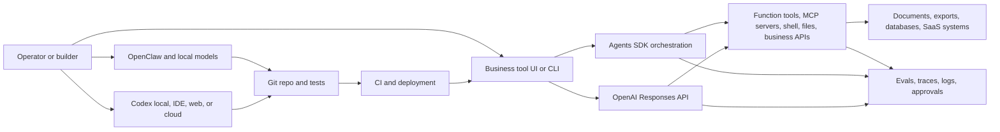

## Executive Thesis

The highest-leverage use of AI for many businesses is not a giant autonomous agent. It is a faster path from operational friction to useful software: a small internal app, a script that removes manual work, a workflow assistant, a data cleanup tool, a support dashboard, or a repeatable deployment path.

Codex is the build layer. OpenAI APIs are the runtime layer. Local AI and tools like OpenClaw can be the privacy, experimentation, and control layer. Used together, they make it possible to turn a business process into a working prototype quickly, then harden it with tests, evals, permissions, traces, and release gates.

This playbook is a technical implementation guide for that motion.

<div class="proof-strip">
  <div>
    <strong>Build with Codex</strong>
    <span>Use Codex locally or in the cloud to inspect repos, make changes, run checks, draft PRs, and encode repeatable workflows.</span>
  </div>
  <div>
    <strong>Run with OpenAI</strong>
    <span>Use the Responses API or Agents SDK for product features that need model reasoning, tool calls, state, guardrails, and traces.</span>
  </div>
  <div>
    <strong>Control the loop</strong>
    <span>Use local AI, OpenClaw, MCP servers, evals, and approvals where privacy, cost, or operator trust matters.</span>
  </div>
</div>

## 1. Target Workflows

Start with work that already has a human-readable process, clear inputs, and a repeatable output. These are easier to prototype, evaluate, and hand back to operators for feedback.

<div class="workflow-grid">
  <article>
    <h3>Internal Tool Builder</h3>
    <p>Turn a spreadsheet, inbox workflow, or recurring manual task into a small web app, CLI, dashboard, or automation.</p>
    <p><strong>Proof metric:</strong> fewer handoffs and less repeated data entry.</p>
  </article>
  <article>
    <h3>Workflow Assistant</h3>
    <p>Summarize context, propose next actions, draft messages, route tasks, and prepare review packets while keeping humans in control.</p>
    <p><strong>Proof metric:</strong> faster decisions with clearer evidence.</p>
  </article>
  <article>
    <h3>Document and Data Intake</h3>
    <p>Extract structured fields, classify files, detect missing information, and prepare exception queues from messy inputs.</p>
    <p><strong>Proof metric:</strong> higher throughput and fewer incomplete packets.</p>
  </article>
  <article>
    <h3>Operations Intelligence</h3>
    <p>Connect exports, logs, tickets, notes, and system records into practical answers for business operators.</p>
    <p><strong>Proof metric:</strong> faster root-cause discovery and fewer status meetings.</p>
  </article>
  <article>
    <h3>Engineering Acceleration</h3>
    <p>Use Codex to understand codebases, implement scoped features, add tests, review PRs, and keep docs synchronized.</p>
    <p><strong>Proof metric:</strong> smaller changes, faster verification, fewer stale docs.</p>
  </article>
  <article>
    <h3>Local AI Workbench</h3>
    <p>Use OpenClaw and local models for private experimentation, workflow sketching, offline review, or low-risk automation.</p>
    <p><strong>Proof metric:</strong> more ideas tested without exposing sensitive data unnecessarily.</p>
  </article>
</div>

## 2. Reference Architecture

Use Codex for changing software and OpenAI APIs for running software. Keep those concerns separate.

Codex is best treated as a repo-aware implementation partner: it reads code, edits files, runs checks, explains unfamiliar systems, and prepares pull requests. The application runtime should use OpenAI APIs directly when the product needs model responses, tool calls, retrieval, or agent orchestration.



### Product Boundaries

| Layer | Use it for | Do not use it for |
|---|---|---|
| Codex | Repo work, implementation, debugging, test generation, PRs, code review, migrations, docs, build scripts. | Silent production actions without review, handling live customer data by default, or replacing CI. |
| Responses API | Direct model calls, tool use, file search, web search, remote MCP, structured outputs, stateful response chains. | Complex multi-agent orchestration when you do not want to own the loop. |
| Agents SDK | Code-first agents with tools, handoffs, guardrails, tracing, sessions, and specialist orchestration. | Tiny one-shot prompts where a direct Responses call is simpler. |
| MCP servers | Bounded access to docs, internal APIs, data exports, logs, and specialized systems. | Broad uncontrolled system access or secrets exposure. |
| OpenClaw and local AI | Local experimentation, private review, low-risk classification, offline drafting, and operator education. | High-stakes production decisions without evaluation and logging. |

## 3. Codex Implementation Loop

Codex should work inside a repo that gives it the same handles a strong engineer would want: clear commands, tests, examples, environment notes, and boundaries.

### Repo Setup

Add these files before asking Codex to do serious work:

```text
AGENTS.md
README.md
.env.example
justfile or package scripts
docs/architecture.md
docs/decisions/
scripts/smoke-*.*
tests/
evals/
```

Use `AGENTS.md` as the operational contract:

```markdown
# Agent Instructions

## Project Goal
Build practical business tools that reduce manual work and keep operators in control.

## Commands
- Build: `just build`
- Unit tests: `just test`
- Local smoke: `just smoke-local`
- Lint: `just lint`

## Boundaries
- Do not edit production secrets.
- Do not change database migrations without explicit approval.
- Prefer small commits with verification evidence.
- When working with OpenAI docs, use the OpenAI developer docs MCP server first.

## Done Means
- Code is implemented.
- Tests or smoke checks pass.
- Risky changes have an approval gate.
- Documentation reflects changed behavior.
```

### Codex Task Shapes

| Task shape | Best Codex mode | Prompt shape |
|---|---|---|
| Understand | Ask mode | "Trace this workflow from UI to database and identify where the manual handoff happens." |
| Implement | Code mode | "Add this scoped feature. Keep files small. Run tests. Show changed paths." |
| Refactor | Code mode | "Reduce duplication in this module without behavior changes. Add tests around extracted helpers." |
| Verify | Ask or code mode | "Run the app, smoke the target routes, and classify expected auth states versus failures." |
| Review | Ask mode | "Review this diff for bugs, regressions, missing tests, and security risk." |
| Operationalize | Code mode | "Turn this manual checklist into a repo-native command and document usage." |

## 4. OpenAI Runtime Pattern

Use the Responses API when the app owns the orchestration loop and you want a direct, inspectable model interaction. OpenAI's docs describe Responses as the recommended primitive for new projects, with built-in support for tools, stateful context, multimodal input, and agentic flows.

### Minimal Tool-Using Service

```typescript
import OpenAI from "openai";

const openai = new OpenAI();

const tools = [
  {
    type: "function",
    name: "lookup_order",
    description: "Look up an order by order number.",
    parameters: {
      type: "object",
      properties: {
        order_number: { type: "string" }
      },
      required: ["order_number"],
      additionalProperties: false
    }
  }
];

export async function answerOperatorQuestion(input: string) {
  const response = await openai.responses.create({
    model: "gpt-5.5",
    instructions: "Help the operator. Use tools for facts. Say when data is missing.",
    input,
    tools,
    metadata: {
      workflow: "ops_assistant",
      environment: "staging"
    }
  });

  return response;
}
```

The important design decision is not the sample code. It is the contract around the tool:

- The tool should have a narrow schema.
- The tool should enforce user permissions before returning data.
- The tool should log request id, user id, arguments, result status, and latency.
- The tool should be idempotent unless a human-approved write path is explicit.
- The model should not be allowed to invent unavailable records.

## 5. Agents SDK Pattern

Use the Agents SDK when the workflow needs more than one specialist, long-running state, guardrails, handoffs, or traceable tool orchestration. The SDK uses the Responses API by default for OpenAI models, but it manages the agent loop for you.

```python
from agents import Agent, Runner, function_tool

@function_tool
def search_internal_docs(query: str) -> str:
    """Search approved internal docs and return grounded snippets."""
    return "matching snippets..."

triage_agent = Agent(
    name="Business tool triage",
    instructions=(
        "Classify the operator's request, gather only necessary context, "
        "and recommend the smallest useful next action."
    ),
    tools=[search_internal_docs],
)

result = Runner.run_sync(
    triage_agent,
    "Customer onboarding keeps stalling. Find the repeated manual step."
)

print(result.final_output)
```

### Specialist Split

| Specialist | Responsibility | Tools |
|---|---|---|
| Triage agent | Classify request, risk, and workflow type. | Request parser, policy lookup. |
| Context agent | Retrieve docs, records, tickets, files, exports, and prior decisions. | File search, MCP, business APIs. |
| Builder agent | Propose implementation plan or draft code tasks for Codex. | Repo context, issue tracker, docs. |
| QA agent | Check factuality, tool outputs, tests, and approval requirements. | Evals, test runner, trace viewer. |
| Operator agent | Produce user-facing summary and next actions. | Notification and ticket tools. |

Use handoffs when a specialist should take over the conversation. Use agents-as-tools when a manager should call a specialist but keep control of the final answer.

## 6. MCP and Tool Gateway

MCP is the cleanest pattern for giving Codex and agents access to bounded external capabilities. The first MCP server to configure is OpenAI's Docs MCP so the agent can pull current OpenAI docs while building.

```bash
codex mcp add openaiDeveloperDocs --url https://developers.openai.com/mcp
codex mcp list
```

Then add project-specific servers only when the boundary is clear:

| MCP server | Read tools | Write tools | Approval |
|---|---|---|---|
| Docs | Search and fetch official docs. | None. | None. |
| Tickets | Search issues, read comments, list assignments. | Create draft issue, add internal note. | Required for external-facing changes. |
| Files | Read approved workspace folders. | Write generated reports. | Required outside workspace. |
| Business system | Lookup records and status. | Draft update, create task. | Required for any customer-impacting write. |
| Deploy | Read build and health status. | Trigger deploy, rollback. | Required. |

Keep MCP tools boring. Each tool should have one job, explicit input schema, permission checks, and structured output.

## 7. Guardrails, Approvals, and Traces

Technical implementation should assume the model will sometimes choose the wrong tool, over-read context, or produce an answer that sounds better than the evidence. The control layer is where the system earns trust.

### Required Controls

| Control | Implementation |
|---|---|
| Input guardrails | Block secrets, prompt injection patterns, unsupported workflow requests, and out-of-scope data. |
| Tool guardrails | Validate arguments before execution and redact outputs after execution. |
| Output guardrails | Check final answers for unsupported claims, missing caveats, and unsafe instructions. |
| Approval gates | Require explicit approval before writes, external messages, deploys, billing changes, or customer-impacting actions. |
| Tracing | Capture model call, tool call, handoff, guardrail, latency, cost, and final output metadata. |
| Sensitive-data mode | Disable or redact sensitive trace payloads where needed. |

### Write-Safety Tiers

| Tier | Behavior | Example |
|---|---|---|
| 0: Read only | Summarize, classify, retrieve, compare. | "Summarize these onboarding blockers." |
| 1: Draft | Prepare a change for review. | "Draft an updated checklist." |
| 2: Approved write | Execute after explicit approval. | "Create the internal follow-up task." |
| 3: Automated low-risk write | Execute routine, reversible operations with logs. | "Tag this record as reviewed." |
| 4: Restricted | Never execute directly. | "Change billing terms" or "delete production data." |

## 8. Evals and Release Gates

Every useful AI workflow should have a small regression set before it goes live. The eval should reflect the actual work, not a generic benchmark.

### Eval Pack

```text
evals/
  onboarding_intake.jsonl
  invoice_exception.jsonl
  tool_call_correctness.jsonl
  permission_boundaries.jsonl
  prompt_injection_cases.jsonl
```

Each case should include:

- The user request.
- The available source context.
- The tools the model is allowed to call.
- The expected output shape.
- The expected tool calls or forbidden tool calls.
- The expected escalation behavior.
- A pass/fail rubric that a human can understand.

### Release Gate

```bash
just test
just eval
just smoke-local
just deploy-preview
```

Do not ship a workflow just because the demo works once. Ship it when the regression set, logs, and operator review all agree it is useful enough and bounded enough.

## 9. Prototype Blueprint: Business Ops Workbench

This is the smallest useful prototype that proves the architecture.

### Features

- Upload or connect a CSV, document folder, ticket export, or app database.
- Ask operational questions in plain language.
- Let the assistant call only approved read tools by default.
- Generate a proposed action plan with evidence.
- Require approval before creating tasks, sending messages, or changing records.
- Store traces and feedback.
- Export a report that a non-technical operator can use.

### Build Plan

1. Use Codex to scaffold the app and add repo-native commands.
2. Add a single OpenAI Responses endpoint with one read-only function tool.
3. Add one MCP server or file-search source for grounded context.
4. Add the first eval pack with 20 real examples.
5. Add approval gates for any write path.
6. Add traces, run ids, and feedback capture.
7. Use Codex to turn repeated verification into `just smoke-local` and `just eval`.
8. Pilot with one operator for one real workflow.

## 10. Implementation Checklist

| Area | Done when |
|---|---|
| Repo | Codex can build, test, smoke, and understand project boundaries from `AGENTS.md`. |
| Runtime | The app uses Responses API directly or Agents SDK intentionally, not accidentally. |
| Tools | Each tool is narrow, typed, logged, permission-aware, and idempotent where possible. |
| MCP | MCP servers are read-first and added only for clear business capabilities. |
| Local AI | OpenClaw/local models have a defined role: private review, offline work, low-risk drafts, or operator education. |
| Evals | A small regression set runs before deployment. |
| Approvals | Writes and external actions require explicit approval unless classified as low-risk automation. |
| Observability | Traces, tool calls, guardrails, cost, latency, and user feedback are inspectable. |
| Deployment | CI can build, test, eval, deploy, and verify the target surface. |

## Official References

- [Codex web](https://developers.openai.com/codex/cloud)
- [Code generation with Codex and OpenAI models](https://developers.openai.com/api/docs/guides/code-generation)
- [Migrate to the Responses API](https://developers.openai.com/api/docs/guides/migrate-to-responses)
- [OpenAI tools guide](https://developers.openai.com/api/docs/guides/tools)
- [Agents SDK guide](https://developers.openai.com/api/docs/guides/agents)
- [Agents SDK tools](https://openai.github.io/openai-agents-python/tools/)
- [Agents SDK guardrails](https://openai.github.io/openai-agents-python/guardrails/)
- [Agents SDK tracing](https://openai.github.io/openai-agents-python/tracing/)
- [OpenAI evals guide](https://developers.openai.com/api/docs/guides/evals)
- [OpenAI Docs MCP](https://developers.openai.com/learn/docs-mcp)

