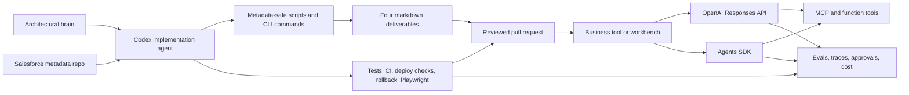

## Executive Thesis

I use Claude while the problem is still fuzzy. I use Codex once the plan needs to become files.

For Salesforce-heavy orgs, integration discovery, migration readiness, and tech debt cleanup do not become real until they are encoded in a repo: scan scripts, metadata inventories, markdown deliverables, validation checks, tests, CI, deployment notes, rollback paths, Playwright smoke checks, and pull requests. That is where Codex earns its keep.

Codex is the implementation layer for the architectural brain. It can inspect the local codebase, run metadata-safe commands, update docs, write small utilities, add tests, fix brittle code, harden pipelines, and keep evidence tied to the change. OpenAI APIs are the runtime layer when the business tool itself needs model reasoning, tool calls, state, guardrails, traces, or a user-facing assistant.

This playbook covers the build loop: use Codex to make the work repeatable, verifiable, and easier for the next consultant or developer to pick up.

<div class="proof-strip">
  <div>
    <strong>Plan into files</strong>
    <span>Turn org-scan thinking into scripts, docs, commands, evals, tests, and pull requests.</span>
  </div>
  <div>
    <strong>Metadata-safe execution</strong>
    <span>Inspect Salesforce metadata and repo structure first. Do not pull record data unless there is a narrow approved reason.</span>
  </div>
  <div>
    <strong>Proof over demos</strong>
    <span>Build the pipeline, run the checks, log the evidence, and ship small useful fixes.</span>
  </div>
</div>

## 1. Target Workflows

Codex works best after the target is bounded. Give it a repo, a clear operating rule, safe commands, and a definition of done. The first goal is usually a repeatable implementation path, not a broad AI assistant.

<div class="workflow-grid">
  <article>
    <h3>Org Scan Automation</h3>
    <p>Write scripts and commands that inventory Salesforce metadata, package structure, automation, permissions, integrations, reports, dashboards, and deployment shape without touching record data.</p>
    <p><strong>Proof metric:</strong> the scan can be rerun and produces the same kind of evidence every time.</p>
  </article>
  <article>
    <h3>Four-Document Deliverable Builder</h3>
    <p>Generate and maintain the executive overview, technical deep dive, improvement backlog, and business-process system map from safe metadata evidence.</p>
    <p><strong>Proof metric:</strong> each conclusion has a confidence label and a source path or safe metadata method.</p>
  </article>
  <article>
    <h3>Integration Discovery</h3>
    <p>Extract source systems, target systems, API touchpoints, middleware references, named credentials, platform events, custom metadata, and ownership questions from the repo.</p>
    <p><strong>Proof metric:</strong> fewer missed dependencies before a migration, platform sunset, or workflow replacement.</p>
  </article>
  <article>
    <h3>Migration Readiness</h3>
    <p>Create object maps, field maps, transformation-rule drafts, data-quality checklists, validation scripts, and cutover notes from metadata and approved mapping artifacts.</p>
    <p><strong>Proof metric:</strong> the team can see source/target gaps before cutover pressure starts.</p>
  </article>
  <article>
    <h3>Pipeline Hardening</h3>
    <p>Add Apex tests, unit tests, GitHub Actions, validation scripts, deployment docs, rollback instructions, release checks, and Playwright smoke tests where the UI matters.</p>
    <p><strong>Proof metric:</strong> small fixes can move safely and quickly.</p>
  </article>
  <article>
    <h3>Tech Debt Repair</h3>
    <p>Turn findings into scoped fixes: brittle tests, duplicated helpers, fragile scripts, stale docs, missing commands, and unsafe deployment paths.</p>
    <p><strong>Proof metric:</strong> the next fix is easier than the last one.</p>
  </article>
</div>

## 2. Reference Architecture

Use Codex for changing the system. Use OpenAI APIs for running the system. Keep those concerns separate.

Codex belongs close to the repo and the terminal. It reads the metadata source, traces scripts, makes edits, runs checks, captures evidence, and prepares changes for review. Use the Responses API or Agents SDK only when a product surface needs model reasoning, structured outputs, tool calls, retrieval, approval gates, traces, or a persistent workflow.

[Kicksights](https://kicksights.com/) is where this direction points: help consultancies and small teams understand what is really inside a Salesforce org, get more from what they already own, and create a clean exit path when purpose-built software is the better fit.



### Product Boundaries

| Layer | Use it for | Do not use it for |
|---|---|---|
| Codex | Repo work, metadata-safe scripts, docs, implementation, debugging, tests, PRs, code review, migration utilities, release hardening. | Silent production changes, unauthorized org actions, record-data inspection by default, or replacing CI. |
| Responses API | Product runtime calls that need model reasoning, tool calls, structured outputs, hosted tools, state, or direct app control. | Repo implementation work that belongs in Codex or shell commands. |
| Agents SDK | Code-first agent workflows with tools, handoffs, guardrails, tracing, sessions, and specialist orchestration. | Tiny one-shot prompts where a direct Responses call is simpler. |
| MCP servers | Bounded access to docs, metadata inventories, internal APIs, safe file stores, and specialized systems. | Broad uncontrolled access, secrets exposure, or business-data scraping. |
| OpenClaw and local AI | Local experimentation, private review, low-risk drafts, and operator education. | High-stakes production decisions without evals and logging. |

## 3. Codex Implementation Loop

Codex needs the same handles a strong engineer would want: clear commands, safe boundaries, examples, tests, environment notes, and a definition of done.

### Repo Setup

Add or maintain these files before asking Codex to do serious work:

```text
AGENTS.md
README.md
.env.example
justfile or package scripts
docs/architecture.md
docs/decisions/
scripts/org-scan/
scripts/smoke-*.*
tests/
evals/
playwright/
```

Use `AGENTS.md` as the operating contract:

```markdown
# Agent Instructions

## Project Goal
Turn org discovery into practical business tools, safer migrations, and faster validated releases.

## Commands
- Build: `just build`
- Unit tests: `just test`
- Org scan: `just org-scan`
- Local smoke: `just smoke-local`
- UI smoke: `just smoke-ui`
- Evals: `just eval`

## Data Boundary
- Metadata first.
- Do not retrieve Salesforce record rows or report results.
- Do not inspect files, logs, payloads, or exports that may contain business data.
- If a question needs record data, mark it `Unknown` and add it to the discovery backlog.

## Boundaries
- Do not edit production secrets.
- Do not deploy or modify org metadata without explicit approval.
- Prefer small commits with verification evidence.
- When working with OpenAI docs, use the OpenAI developer docs MCP server first.

## Done Means
- Code or docs are implemented.
- Tests, evals, smoke checks, or build checks pass.
- Risky actions have an approval gate.
- Findings cite safe evidence.
- Documentation reflects changed behavior.
```

### Codex Task Shapes

| Task shape | Best Codex mode | Prompt shape |
|---|---|---|
| Inspect | Ask mode | "Trace the repo structure and list safe metadata evidence sources. Do not inspect record data." |
| Inventory | Code mode | "Create a metadata-only org scan command that counts components and writes structured JSON." |
| Generate deliverables | Code mode | "Use the scan output to update the four markdown docs. Label each conclusion Confirmed, Inferred, or Unknown." |
| Implement | Code mode | "Fix this deployment pipeline issue. Keep the change small. Run checks. Show changed paths." |
| Verify | Ask or code mode | "Run build, tests, evals, and Playwright smoke. Separate expected auth-gated states from failures." |
| Review | Ask mode | "Review this diff for bugs, unsafe data access, missing tests, and deployment risk." |
| Operationalize | Code mode | "Turn this manual migration checklist into repo-native commands and docs." |

## 4. Data-Safe Org Scan Workflow

For org scans, Codex creates the mechanics behind the analysis. It turns the data-safe prompt into scripts, commands, and durable files that another consultant can rerun.

### Non-Negotiable Boundary

Do not retrieve Salesforce business data, user data, record-level data, report results, sample rows, file contents, message contents, payload contents, or debug logs by default. Pulling data first and redacting later is not acceptable.

Safe evidence includes:

- Local Salesforce metadata source.
- Metadata, Tooling, schema describe, and inventory calls.
- Object, field, relationship, record type, picklist, layout, flexipage, app, tab, permission, package, automation, integration, and deployment metadata.
- Component counts and active/inactive metadata state.
- Named credentials and integration shape without secrets, endpoint details, tokens, certificates, usernames, or payload examples.

When a conclusion requires live data, Codex writes `Unknown` and adds the question to the follow-up backlog.

### Four Deliverables

| File | Codex responsibility |
|---|---|
| `01-executive-overview.md` | Keep it concise, business-first, and grounded in safe evidence. Summarize what the org appears to do, major risks, and highest-value improvements. |
| `02-technical-deep-dive.md` | Map where functionality lives: objects, record types, Flows, Apex, validation rules, UI layers, permissions, packages, integrations, tests, and deployment shape. |
| `03-improvement-areas-and-open-questions.md` | Produce the blunt backlog: quick wins, structural improvements, high-risk areas, open questions, safe next inspections, blockers, and blind spots. |
| `04-business-process-system-map.md` | Create the visual onboarding guide with Mermaid diagrams, numbered narratives, lifecycle maps, and a process-to-metadata index. |

### Evidence Labels

Every major conclusion gets a label:

- `Confirmed`: directly supported by metadata file paths or safe sandbox metadata/describe/inventory evidence.
- `Inferred`: strongly suggested by naming, structure, formulas, flow labels, configuration relationships, or correlated metadata.
- `Unknown`: not enough safe evidence under the no-record-data constraint.

### Repo-Native Command Shape

```bash
just org-scan
just org-scan-docs
just org-scan-validate
just test
just smoke-ui
```

Codex creates these commands only when they are real and maintainable. A fake command is worse than a manual step.

## 5. OpenAI Runtime Pattern

Use the Responses API when the product owns the orchestration loop and needs a direct model interaction. Current OpenAI guidance treats Responses as the right primitive for model calls with tools, state, structured outputs, hosted tools, and agentic workflows.

For org-scan tooling, the runtime pattern is usually read-first:

```typescript
import OpenAI from "openai";

const openai = new OpenAI();

const tools = [
  {
    type: "function",
    name: "lookup_metadata_component",
    description: "Look up a Salesforce metadata component by type and API name. Never returns record data.",
    parameters: {
      type: "object",
      properties: {
        component_type: { type: "string" },
        api_name: { type: "string" }
      },
      required: ["component_type", "api_name"],
      additionalProperties: false
    }
  }
];

export async function explainOrgFinding(input: string) {
  return openai.responses.create({
    model: "gpt-5.5",
    instructions: [
      "You explain Salesforce org findings from metadata only.",
      "Do not request or infer record-level data.",
      "Label conclusions Confirmed, Inferred, or Unknown."
    ].join(" "),
    input,
    tools,
    metadata: {
      workflow: "org_scan",
      data_boundary: "metadata_only"
    }
  });
}
```

The important design decision is the tool contract:

- The tool has a narrow schema.
- The tool enforces the data boundary before returning anything.
- The tool logs request id, user id, arguments, result status, and latency.
- The tool is idempotent unless a human-approved write path is explicit.
- The model cannot invent unavailable metadata or record usage patterns.

## 6. Agents SDK Pattern

Use the Agents SDK when the work needs specialists, handoffs, guardrails, tracing, or a long-running stateful workflow. The SDK moves tool wiring into agent definitions and workflow design. That fits org-scan work because different specialists can own different slices without pretending one prompt can do everything.

```python
from agents import Agent, Runner, function_tool

@function_tool
def search_metadata_index(query: str) -> str:
    """Search approved Salesforce metadata inventory. Never returns record data."""
    return "matching metadata evidence..."

org_explainer = Agent(
    name="Org explainer",
    instructions=(
        "Explain Salesforce org behavior from metadata evidence only. "
        "Label every major conclusion Confirmed, Inferred, or Unknown."
    ),
    tools=[search_metadata_index],
)

result = Runner.run_sync(
    org_explainer,
    "Summarize where onboarding logic appears to live and what needs more discovery."
)

print(result.final_output)
```

### Specialist Split

| Specialist | Responsibility | Tools |
|---|---|---|
| Metadata inventory agent | Count and index metadata components. | Local files, Salesforce metadata describe, Tooling inventory. |
| Org explainer agent | Turn metadata into business-process interpretation. | Metadata index, architecture docs, safe component references. |
| Integration mapper agent | Identify external systems, source-of-truth questions, event paths, and ownership gaps. | Named credential inventory, custom metadata, platform events, docs. |
| Migration readiness agent | Draft field maps, transformation-rule candidates, validation checks, and cutover risks. | Metadata index, approved mapping docs, validation scripts. |
| Pipeline agent | Harden tests, CI, deployment docs, rollback, and UI smoke checks. | Shell, test runner, Playwright, GitHub Actions. |
| QA reviewer agent | Check evidence labels, unsafe data access, unsupported claims, and regression risk. | Evals, trace viewer, diff review, policy checklist. |

Use handoffs when a specialist owns a phase. Expose specialists as tools when a manager agent needs control of the final report.

## 7. MCP and Tool Gateway

MCP is useful when the boundary is clear. For Codex, start with OpenAI's Docs MCP so current API, Agents SDK, and Codex guidance is available while building.

```bash
codex mcp add openaiDeveloperDocs --url https://developers.openai.com/mcp
codex mcp list
```

Then add project-specific servers only when they are boring and narrow.

| MCP server | Read tools | Write tools | Approval |
|---|---|---|---|
| Docs | Search and fetch official docs. | None. | None. |
| Salesforce metadata | Describe objects, fields, layouts, Flows, Apex, permissions, packages. | None by default. | Required for metadata writes. |
| Files | Read approved workspace folders and generated scan artifacts. | Write reports and structured scan outputs. | Required outside workspace. |
| GitHub | Read issues, PRs, checks, and workflow logs. | Create branches, commits, comments, or PRs. | Required for publish steps. |
| Deploy | Read build, preview, and health status. | Trigger deploy or rollback. | Required. |

Keep MCP tools simple. Each tool has one job, explicit input schema, permission checks, structured output, and no secret leakage.

## 8. Guardrails, Approvals, and Traces

Assume the model will sometimes choose the wrong tool, over-read context, or produce an answer that sounds better than the evidence. The control layer is where the system earns trust.

### Required Controls

| Control | Implementation |
|---|---|
| Data boundary guardrails | Block record queries, report results, list views, file contents, payloads, debug logs, and sample rows unless separately approved. |
| Tool guardrails | Validate arguments before execution and refuse unsafe Salesforce data access. |
| Output guardrails | Check final docs for unsupported claims, missing confidence labels, exposed secrets, or accidental data references. |
| Approval gates | Require explicit approval before writes, external messages, deploys, metadata changes, billing changes, or customer-impacting actions. |
| Tracing | Capture model call, tool call, handoff, guardrail, latency, cost, final output metadata, and source artifact versions. |
| Sensitive-data mode | Disable or redact sensitive trace payloads where needed. |

### Write-Safety Tiers

| Tier | Behavior | Example |
|---|---|---|
| 0: Metadata read only | Summarize, classify, retrieve, compare. | Explain object and automation structure without record rows. |
| 1: Draft | Prepare a change or report for review. | Draft a migration-readiness report or validation checklist. |
| 2: Approved repo write | Edit local files after review boundary is clear. | Add a scan script, test, doc, or GitHub Actions check. |
| 3: Approved org/deploy action | Execute only after explicit approval and validation. | Deploy a metadata fix or trigger a production release. |
| 4: Restricted | Never execute directly. | Read customer records, approve money, change contract terms, delete production data, or bypass compliance. |

## 9. Evals and Release Gates

Every useful Codex workflow needs a regression set before it becomes trusted. The eval reflects the real work, not a generic benchmark.

### Eval Pack

```text
evals/
  org_scan_findings.jsonl
  metadata_boundary_cases.jsonl
  integration_mapping.jsonl
  migration_readiness.jsonl
  pipeline_hardening.jsonl
  prompt_injection_cases.jsonl
```

Each case includes:

- The task request.
- The safe source context.
- The tools the model is allowed to call.
- The expected output shape.
- The required evidence labels.
- Forbidden data access or forbidden tool calls.
- Expected escalation behavior.
- A pass/fail rubric that a human can understand.

### Release Gate

```bash
just build
just test
just org-scan-validate
just eval
just smoke-local
just smoke-ui
just deploy-preview
```

Do not ship a workflow because the demo works once. Ship it when the regression set, logs, operator review, and deployment pipeline all agree it is useful enough and bounded enough.

## 10. Prototype Blueprint: Org Scan Workbench

The smallest useful prototype is an org scan workbench that proves the architecture.

### Features

- Connect a Salesforce metadata repo and authorized metadata-only org access.
- Run a safe org scan from repo-native commands.
- Generate the four markdown deliverables.
- Index metadata components with source paths and confidence labels.
- Show integration, migration, permission, and deployment risks.
- Let the assistant answer questions from metadata evidence only.
- Require approval before any write, deploy, or deeper data access.
- Store traces, eval scores, version history, and feedback.

### Build Plan

1. Use Codex to add repo-native scan commands and structured scan output.
2. Add the no-record-data policy to `AGENTS.md`, scripts, tool descriptions, and evals.
3. Generate the first four markdown deliverables from safe metadata evidence.
4. Add validation checks for missing evidence labels, broken markdown links, Mermaid syntax, and unsafe terms.
5. Add Apex/unit tests, GitHub Actions, deployment docs, rollback notes, and Playwright UI smoke checks where applicable.
6. Add a single Responses endpoint or Agents SDK workflow only if the workbench needs a runtime assistant.
7. Add eval packs for org findings, integration mapping, migration readiness, permission boundaries, and prompt injection.
8. Pilot it against one serious org and compare the output to consultant review.

## 11. Implementation Checklist

| Area | Done when |
|---|---|
| Repo | Codex can build, test, smoke, scan, and understand boundaries from `AGENTS.md`. |
| Data boundary | Metadata-only behavior is enforced in prompts, scripts, tool descriptions, evals, and review checks. |
| Org scan | The scan produces reusable structured output and cites safe evidence. |
| Deliverables | The four markdown docs are generated or maintained with confidence labels and source references. |
| Pipeline | CI can build, test, eval, validate docs, deploy preview, and run UI smoke checks where needed. |
| Runtime | The app uses Responses API directly or Agents SDK intentionally, not accidentally. |
| Tools | Each tool is narrow, typed, logged, permission-aware, and idempotent where possible. |
| MCP | MCP servers are read-first and added only for clear capabilities. |
| Local AI | OpenClaw/local models have a defined role: private review, offline work, low-risk drafts, or operator education. |
| Observability | Traces, tool calls, guardrails, cost, latency, approvals, and user feedback are inspectable. |

## Official References

- [Building an AI-Native Engineering Team](https://developers.openai.com/codex/guides/build-ai-native-engineering-team)
- [Codex web](https://developers.openai.com/codex/cloud)
- [Code generation with Codex and OpenAI models](https://developers.openai.com/api/docs/guides/code-generation)
- [Migrate to the Responses API](https://developers.openai.com/api/docs/guides/migrate-to-responses)
- [OpenAI tools guide](https://developers.openai.com/api/docs/guides/tools)
- [Agents SDK guide](https://developers.openai.com/api/docs/guides/agents)
- [Agents SDK tools](https://openai.github.io/openai-agents-python/tools/)
- [Agents SDK guardrails](https://openai.github.io/openai-agents-python/guardrails/)
- [Agents SDK tracing](https://openai.github.io/openai-agents-python/tracing/)
- [OpenAI evals guide](https://developers.openai.com/api/docs/guides/evals)
- [OpenAI Docs MCP](https://developers.openai.com/learn/docs-mcp)
