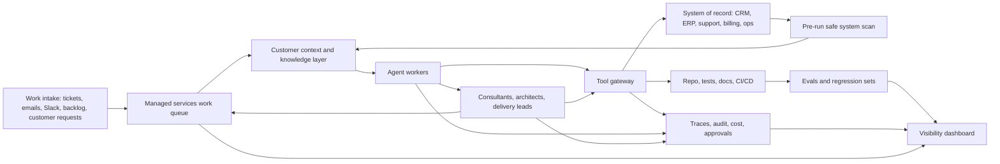
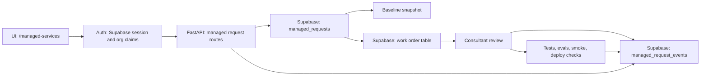
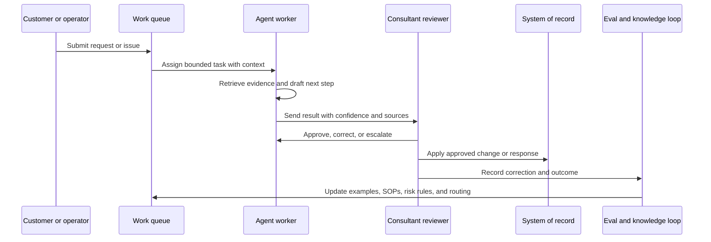

## Executive Summary

The centerpiece is a managed services platform for implementation and support work around systems of record.

Salesforce is the concrete example because it is familiar, messy, and operationally important. The broader target is any complex, constantly shifting system of record that cannot go down and has to be changed with care. It could be an ERP, billing system, support platform, loan origination system, warehouse system, data platform, or internal operations tool. The pattern is the same: the business runs on it, the work never stops, and careless automation can create more damage than value.

The platform is a cooperative system for humans and agents working together. It takes in real managed-services work, enriches the request with customer context and prior knowledge, routes tasks, drafts analysis or fixes, asks for approval at the right moments, runs checks, logs decisions, learns from feedback, and gives the team visibility into what is happening.

Chatbots and demo agents are too small a frame. The useful thing here is an operating layer for implementation work, support queues, data migrations, release readiness, and a more accessible software delivery process.

The reason to start with systems of record is simple. If the loop works there, it can work in easier places too. These systems have old decisions, active users, permission boundaries, integrations, release windows, customer pressure, and a real cost when something breaks. That is where an agent system has to earn trust instead of just looking impressive.

### Normal Development Choices

Start with the boring pieces: existing auth, the existing ticketing or intake source, a small database schema, a typed API, a simple queue UI, an event stream, and repo-native checks. Add agents only after the work object, system context, approval path, and validation loop are clear.

For a Salesforce team, the system context is org metadata, releases, permissions, integrations, and baseline snapshots. For another team, the same slot might be ServiceNow configuration, NetSuite scripts, Zendesk routing, warehouse workflows, claims data, billing rules, or internal product telemetry. The operating model stays the same even when the source system changes.

  

    <strong>Real workload</strong>
    New requests, bug fixes, backlog items, system scans, migrations, releases, and managed-services support.
  

  

    <strong>Human and AI loop</strong>
    Agents do bounded work. Consultants review, decide, approve, and turn repeated patterns into better operating rules.
  

  

    <strong>Visible system</strong>
    Every task has status, related facts, customer objectives, owner, risk, trace, evaluation result, and next action.
  

## 1. Why This Fits Cooperative Systems

Managed services work is a good proving ground because it is close to customers, full of repeatable operational work that generally falls into a few dozen categories, and risky enough that being correct matters. A team is constantly asked to explain the system, fix production issues, clean up old decisions, prepare releases, migrate data, answer support questions, and keep the customer moving.

That gives the platform a useful shape:

- The work is real and measurable.
- The users are close enough to give fast feedback.
- The tasks cross support, sales, finance, IT, implementation, and engineering.
- The source of truth is important enough to require careful permissions, audit trails, and approval gates.
- The backlog is large enough that agents can help, but ambiguous enough that humans still own judgment.

The consultant role moves up the stack. Agents can handle more of the inspection, drafting, comparison, testing, and documentation. Consultants own diagnosis, architecture, customer trust, change sequencing, and the decision about what work deserves to exist.

## 2. Target Workloads

A first useful version supports work a real managed-services team already does every week.

  <article>
    <h3>Support Request Triage</h3>
    
Classify incoming requests, identify missing context, connect the request to known system areas, and decide whether it is a bug, training issue, config change, data issue, or architecture problem.

    
<strong>Proof metric:</strong> faster first response and fewer tickets bouncing between people.

  </article>
  <article>
    <h3>System Scan and Explainer</h3>
    
Pre-run safe scans, explain objects and automation, identify land mines, and keep a current-state map ready before recommending changes.

    
<strong>Proof metric:</strong> new consultants can understand the system without depending on one person with tribal knowledge.

  </article>
  <article>
    <h3>Tech Debt Work Queue</h3>
    
Turn stale fields, brittle flows, weak tests, permission drift, and deployment friction into prioritized, reviewable work.

    
<strong>Proof metric:</strong> the backlog gets cleaner and future fixes get easier.

  </article>
  <article>
    <h3>Release Readiness</h3>
    
Prepare deployment notes, check (and then enhance) tests, validate rollback paths, review impacted metadata, and flag unresolved risk before a change ships.

    
<strong>Proof metric:</strong> fewer surprises during deployment and faster movement from finding to reviewed fix.

  </article>
  <article>
    <h3>Migration Readiness</h3>
    
Map source and target systems, field dependencies, transformation rules, validation checks, and the repeatable path for loading data into the target system.

    
<strong>Proof metric:</strong> migration risk is visible before cutover pressure starts.

  </article>
  <article>
    <h3>Customer Escalation Packets</h3>
    
Summarize the issue, evidence, suspected root cause, impacted workflows, proposed next step, and decision needed from the customer or delivery lead.

    
<strong>Proof metric:</strong> escalations arrive with enough context for a decision.

  </article>

## 3. Reference Architecture

The platform is a control plane around managed-services work. It can sit beside Jira, Slack, Salesforce, GitHub, ServiceNow, Zendesk, NetSuite, and the customer's source systems on day one. Its job is to make the work visible, bounded, reviewable, and easier to improve.

### Core Platform Primitives

| Primitive | What it does | Reason |
|---|---|---|
| Intake classifier | Tags work by customer, workflow, system area, urgency, risk, and likely owner. | Keeps the queue from becoming a junk drawer. |
| System context layer | Stores scan output, diagrams, implementation notes, prior decisions, metadata or configuration, and current risks. | Gives agents and humans the same starting point. |
| Agent task runner | Runs bounded jobs: explain, compare, draft, validate, test, summarize, or prepare. | Turns repeated work into observable units. |
| Tool gateway | Provides narrow access to configuration, metadata, repos, docs, tickets, and approved systems. | Keeps automation useful without giving it uncontrolled reach. |
| Human review layer | Assigns approvals, escalations, QA, and architecture review. | Preserves judgment and customer trust. |
| Evaluation layer | Replays golden examples, boundary cases, tool-call checks, and release gates. | Shows whether the system is getting better or just louder. |
| Visibility dashboard | Shows queue health, agent output, review load, risk, escalations, latency, cost, and outcomes. | Lets a manager run the hybrid workforce instead of guessing. |

## 4. Kicksights Implementation Notes

### Why Kicksights Is Here

Kicksights is the real place I am working through this problem. I am using Salesforce first because it has the right constraints: metadata, permissions, stale automation, integrations, migrations, release risk, and users who still need the system to work while it is changing.

That makes it a useful stress test. The broader use case is a team inheriting a messy system of record and needing a safer way to understand it, support it, improve it, and sometimes migrate away from it.

Kicksights already has pieces of that shape. The finished cooperative platform still needs more work, but the first slice is useful because it turns the idea into real product primitives: an authenticated managed-services workspace, persisted requests, system baseline references, work-order drafts, event history, and a path back to overview evidence.

The Salesforce names below are implementation labels, not requirements. In another domain, `managed_requests` and `managed_request_events` stay almost the same. `salesforce_work_orders` becomes `delivery_work_orders`, `org_connections` becomes `system_connections`, and `baseline_snapshot_id` points to the current safe map of whichever system the team supports.

### What Kicksights Already Models

| Piece | Kicksights shape | Reason |
|---|---|---|
| Managed-services workspace | `/managed-services` lets a user open a support request, choose work type, priority, delivery risk, next reviewer, and optional pinned system baseline. | Intake becomes structured enough for humans and agents to work from the same object. |
| Request types | Admin/config work, automation fix, integration, data migration, reporting, security, release promotion, and discovery scoping. | The queue starts with the categories managed-services teams actually see. |
| Lifecycle state | Submitted, triaging, needs clarification, scoped, queued for build, building, validating, ready for review, approved, promoting, done, blocked, canceled. | The platform can show where work is stuck and who owns the next move. |
| Next actor | Intake, blueprint, architect, builder, QA, release, migration, or client. | Early versions can route work before every agent worker is fully automated. |
| System baseline | A request can pin a baseline snapshot, or the service can attach the latest ready baseline when one exists. | Delivery work is grounded in the current system shape instead of memory or Slack archaeology. |
| Work orders | Draft work orders carry scope, out-of-scope items, affected components, acceptance criteria, validation plan, rollback plan, artifacts, and audit references. | A work order becomes the contract between intake, architecture review, build, QA, and approval. |
| Event stream | Request submitted, updated, clarified, approved, rejected, and work-order drafted events are stored with payload metadata. | Corrections and decisions become product signal instead of disappearing into chat. |
| Auth and data boundary | The worker validates Supabase JWTs, org membership is resolved server-side, and Supabase RLS filters org-owned records. | The managed-services queue can be shared without leaking another customer's work. |

The important implementation choice is durable state before autonomy. Once the request, baseline, events, and work-order contract exist, agents have something safe and specific to operate on.

### Kicksights-Style Technical Stack

| Layer | Concrete implementation pattern |
|---|---|
| Frontend | Next.js and React workspace with typed API normalization, status buckets, routing controls, technical references, activity history, and work-order display. |
| Worker | FastAPI routes for create/list/get/update managed requests, list events, draft work orders, record clarifications, approve/reject requests, create org connections, and pin baselines. |
| Database | Supabase Postgres tables for `org_connections`, `managed_requests`, `managed_request_events`, and `salesforce_work_orders`, with indexes around org/status/baseline/request lookups. |
| Access control | Supabase Auth, JWT claim resolution, server-side org resolution, and RLS policies for org-scoped visibility. |
| System context | Org overview and OKG snapshots are the Kicksights baseline context layer. In another system, this can be configuration snapshots, dependency maps, workflow traces, or knowledge graph output. A request can carry `baseline_snapshot_id` so the team knows which system picture informed the scope. |
| Reliability | Repo-native commands for build, worker tests, local route smoke, staging deploy, production deploy, org-overview refresh/retry/cancel/promote, and prompt rollout checks. |
| Evals | Offline org-spec and prompt-contract evaluators with explicit thresholds before stricter blocking behavior is enabled. |
| Live verification | Local smoke can use expected auth-gated states, but protected staging/prod flows need real Supabase sessions because the worker validates JWTs. |

### API Contract Shape

| Endpoint shape | Purpose |
|---|---|
| `POST /managed-requests` | Create the request, resolve org/user context, attach the latest baseline when available, set risk and next actor, and write `request.submitted`. |
| `GET /managed-requests` | List org-scoped work with status filtering, limit, and offset. |
| `GET /managed-requests/{request_id}` | Hydrate one request with child events and work orders. |
| `PATCH /managed-requests/{request_id}` | Update queue state, priority, risk, next actor, scope fields, artifacts, and audit references. |
| `GET /managed-requests/{request_id}/events` | Return the chronological decision and activity stream. |
| `POST /managed-requests/{request_id}/clarifications` | Record a question or answer and move the request between `needs_clarification`, `triaging`, and the next baseline step. |
| `POST /managed-requests/{request_id}/work-orders` | Generate the draft delivery object with scope, validation, rollback, affected components, and audit refs. |
| `POST /managed-requests/{request_id}/approve` | Move the request to `approved` or `blocked` and set the next actor for builder or architect review. |
| `POST /org-connections` | Register source, target, sandbox, UAT, archive, or client-managed systems. |
| `POST /org-connections/{org_connection_id}/baseline` | Pin an org connection to a baseline snapshot and status. |

### One-Layer-Deeper Build Sequence

1. **Create the work object first.** Define a `managed_requests` record with `org_id`, `type`, `priority`, `status`, `title`, `business_goal`, `risk_level`, `next_required_actor`, `baseline_snapshot_id`, `artifacts`, `audit_refs`, and `intake_payload`.
2. **Add an event stream immediately.** Every submit, update, clarification, approval, rejection, work-order draft, validation result, deploy attempt, and customer decision writes an event. The event stream becomes the memory of the system.
3. **Pin system context before action.** Attach the latest org baseline when possible. If the request touches migration, integration, security, or release promotion, treat missing baseline context as medium or high risk until a human confirms otherwise.
4. **Generate work orders instead of loose recommendations.** A work order needs scope, out-of-scope items, affected components, acceptance criteria, validation plan, rollback plan, artifacts, and audit references. That is the handoff object an agent, consultant, QA reviewer, or release manager can share.
5. **Use agent workers as state transitions.** The intake agent classifies and requests missing detail. The blueprint agent attaches baseline evidence. The architect agent drafts scope. The builder agent proposes repo, metadata, or configuration changes. The QA agent runs checks. The release agent prepares promotion and rollback evidence.
6. **Keep writes approval-gated.** Agents can draft, compare, summarize, test, and prepare. Production writes, configuration changes, metadata deploys, customer messages, contract decisions, and data movement wait for human approval.
7. **Bake evals into release.** Run golden request examples, unsafe-tool-call cases, metadata-boundary cases, and reviewer-correction cases before new agent behavior becomes trusted.
8. **Expose manager-level visibility.** The dashboard shows request counts by status, stuck work, next actor, baseline coverage, reviewer burden, correction rate, eval failures, cost, latency, and customer-facing risk.

That is the bridge to cooperative systems work. Calling a model is the easy part. The harder work is creating the work object, the context layer, the permission boundary, the review path, the eval loop, and the feedback signal so humans and agents can move real work without creating chaos.

## 5. Human and Agent Operating Model

Agents are useful when the work is bounded. Humans are useful when the work needs judgment, context, sequencing, taste, or trust.

| Work type | Agent role | Human role |
|---|---|---|
| Support triage | Classify, summarize, find related evidence, identify missing context. | Decide priority, customer tone, owner, and escalation path. |
| System analysis | Scan metadata or configuration, group findings, cite evidence, mark unknowns. | Decide what matters, what to ignore, and what to ask the customer. |
| Implementation prep | Draft code changes, test additions, deployment notes, and rollback steps. | Review architecture, approve scope, merge only after checks pass. |
| Migration planning | Draft field maps, identify validation needs, list unknowns. | Own source-of-truth decisions and acceptable tradeoffs. |
| Knowledge updates | Suggest SOP changes from repeated tickets and corrections. | Approve durable policy and process changes. |
| Customer communication | Draft clear explanations and escalation packets. | Send the message, own the relationship, and make the call. |

The operating rule is simple: agents can move work forward. Production changes, compliance decisions, missing evidence, and customer commitments stay under human control.

## 6. Learning Loop

A cooperative platform improves because the work is instrumented. The team can see where agents helped, where they failed, where humans corrected them, and where the process itself is broken.

The correction loop matters more than the first answer. If a consultant rejects an output, the system captures why: bad context, missing tool, stale SOP, weak prompt, permission issue, poor judgment, or a true edge case. That turns review work into product signal.

## 7. Evaluation Framework

Measure the actual work instead of a random benchmark. Start with a clear definition of what good looks like, then turn that into a repeatable scoring path. A simple rubric can use `-1`, `0`, and `1`: harmful or wrong, incomplete, useful enough to trust after review.

| Evaluation Area | What to Test | Pass Standard |
|---|---|---|
| Task success | Did the agent complete the requested support, scan, release, or migration prep task? | The output is useful enough for a reviewer to act on. |
| Evidence quality | Did it cite metadata, configuration, docs, tickets, or repo paths instead of guessing? | Major claims have sources or are marked unknown. |
| Tool correctness | Did it call the right tool with safe arguments? | No unsafe record access, broad scraping, or unavailable tool invention. |
| Permission adherence | Did it respect customer, system, repo, and data boundaries? | Sensitive actions stop at approval gates. |
| Escalation behavior | Did it ask for help when confidence was low or risk was high? | Risky cases reach a human with a clear reason. |
| Regression control | Did a fix break known good behavior? | Golden cases and release checks stay green. |
| Reviewer burden | Did the system save time without creating cleanup work? | Reviewer corrections go down over time. |
| Cost and latency | Is the workflow worth running repeatedly? | Runtime, cost, and review time fit the value of the task. |

## 8. Pilot Plan

Start with one serious managed-services workflow: support triage plus escalation packet generation for a customer running a system of record. Salesforce is a good first example, but the pilot proves the operating model rather than the CRM-specific vocabulary.

  <section>
    <h3>Days 0-30: One Queue, One Customer, Real Evidence</h3>
    
<strong>Objective:</strong> make the first support workflow visible and reviewable.

    <ul>
      <li>Connect one intake source and one customer workspace.</li>
      <li>Run the safe system scan and create the first customer context layer.</li>
      <li>Classify incoming work by system area, risk, urgency, and missing context.</li>
      <li>Generate escalation packets for human review.</li>
      <li>Track corrections, approval decisions, time saved, and unresolved unknowns.</li>
    </ul>
    
<strong>Exit criteria:</strong> the team can see the queue, trust the evidence, and review agent work without digging through scattered context.

  </section>
  <section>
    <h3>Days 31-60: Add Implementation and Release Support</h3>
    
<strong>Objective:</strong> connect support findings to real delivery work.

    <ul>
      <li>Turn recurring issues into scoped backlog items.</li>
      <li>Add repo-native checks for tests, docs, deployment notes, rollback, and UI smoke where needed.</li>
      <li>Create eval cases from accepted and rejected support outputs.</li>
      <li>Add approval gates for code changes, configuration changes, metadata changes, and customer-impacting actions.</li>
    </ul>
    
<strong>Exit criteria:</strong> repeated problems turn into reviewed fixes, and every change has a validation path.

  </section>
  <section>
    <h3>Days 61-90: Make It Repeatable</h3>
    
<strong>Objective:</strong> turn one customer workflow into a managed-services operating model.

    <ul>
      <li>Package reusable intake, scan, escalation, eval, and release patterns.</li>
      <li>Add dashboard views for queue health, risk, reviewer load, cost, latency, and outcome quality.</li>
      <li>Expand to a second customer or a second workflow only after the first loop is trusted.</li>
      <li>Document where the platform generalizes beyond Salesforce.</li>
    </ul>
    
<strong>Exit criteria:</strong> the team has a repeatable human/AI delivery loop that can move to another customer or workflow.

  </section>

## 9. Engineering Manager Operating Model

The engineering manager role here is still hands-on: shaping the primitives, owning reliability, reading traces, talking to users, reviewing architecture, and making sure the team is learning from real work.

### Weekly Cadence

- Review queue health, escalations, and reviewer burden.
- Pick the smallest useful product improvement from real operator pain.
- Review failed evals and rejected agent outputs.
- Turn repeated manual review into a better tool, prompt, SOP, or guardrail.
- Keep the platform boring where it needs to be boring: logs, permissions, deploys, rollback, tests, and ownership.
- Ship small improvements frequently enough that users keep giving honest feedback.

### Team Shape

| Role | Ownership |
|---|---|
| Engineering manager | Architecture, team focus, user loop, reliability, prioritization, and hands-on technical review. |
| Full-stack/product engineer | Queue UI, dashboards, workbench surfaces, workflow state, and operator experience. |
| AI/platform engineer | Agent workflows, tool gateway, traces, evals, guardrails, and model integration. |
| Systems/data engineer | Metadata ingestion, knowledge layer, reporting, audit, cost, and system integrations. |
| Embedded consultant or ops lead | Workflow diagnosis, acceptance criteria, customer context, and feedback quality. |

## 10. Proof Package

The public artifact shows the platform through one realistic workflow:

1. A managed-services request arrives for Salesforce or another system of record.
2. The platform classifies the request and finds the relevant system context.
3. An agent drafts an escalation packet with evidence, confidence, unknowns, and proposed next action.
4. A consultant reviews, corrects, and approves the packet.
5. Repeated findings become a backlog item, test, SOP update, or release task.
6. The dashboard shows queue health, agent performance, reviewer load, cost, latency, and unresolved risk.

The proof generalizes cleanly. Swap Salesforce for another system of record and the same cooperative pattern still works: intake, context, bounded agent work, human review, safe tools, evals, traces, and a feedback loop that makes the whole operation better over time.
